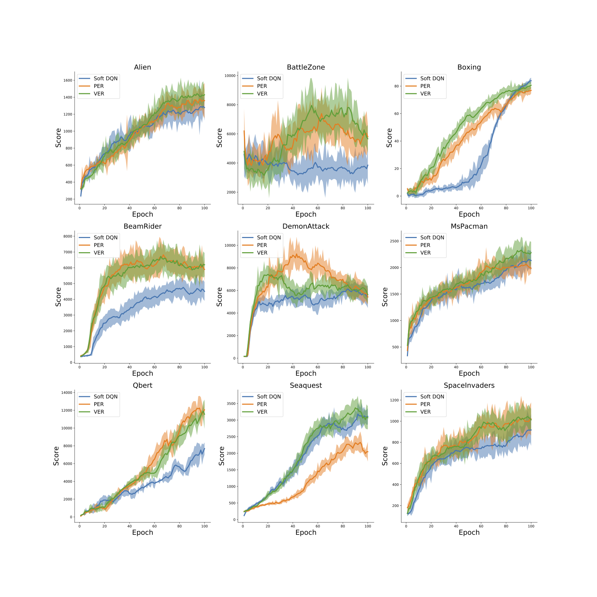

# Revisiting Prioritized Experience Replay: A Value Perspective (VER)

This repository contains code from a under-reviewed paper of AAAI 25: Revisiting Prioritized Experience Replay: A Value Perspective. Codes are written in python 3, and provided in jupyter notebook format (.ipynb).

## Code for Figure 3 and 4: Results of Q-learning and soft Q-learning in Maze

Q-learning: [maze_q_learning.ipynb](./code/maze_q_learning.ipynb)

soft Q-learning: [maze_soft_q_learning.ipynb](./code/maze_soft_q_learning.ipynb)

## Code for Figure 4: Results of DQN and soft DQN in CartPole

DQN: [cartpole_dqn.ipynb](./code/cartpole_dqn.ipynb)

soft DQN: [cartpole_soft_dqn.ipynb](./code/cartpole_soft_dqn.ipynb)

## Code for Figure 6: Valuable Experience Replay (VER) in Atari game

[SoftDQN_VER_Seaquest.ipynb](./code/SoftDQN_VER_Seaquest.ipynb)

